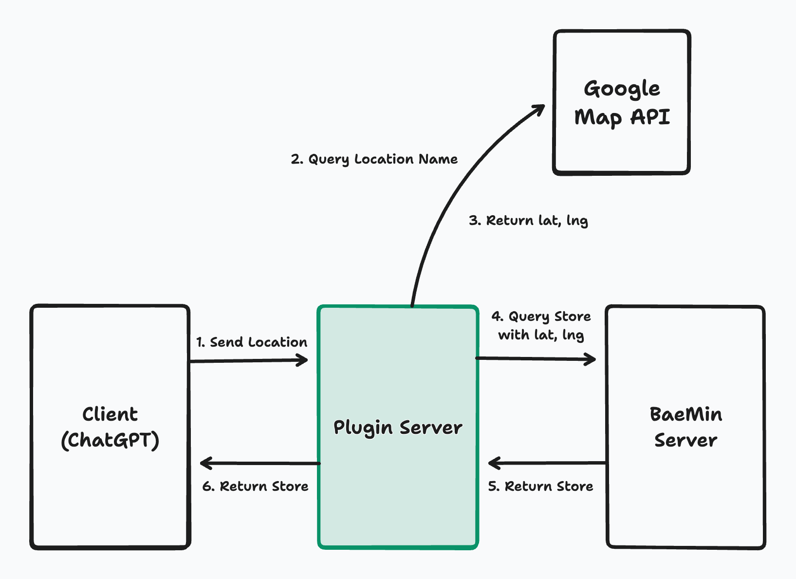

# BaeChat - ChatGPT BaeMin Plugin


BaeChat is a plugin for OpenAI's ChatGPT model that integrates with BaeMin, a popular food delivery service in South Korea. BaeChat allows users to search for and recommend restaurants near their location using the BaeMin service.

## Installation

First, visit [Google Cloud](https://cloud.google.com/), and obtain an API key with 'Geocoding' permissions.

You can install and run BaeChat using Docker:

```shell
docker pull ghcr.io/amclio/baechat:latest
docker run -e GOOGLE_MAP_API_KEY=your_google_map_api_key -p 3000:3000 ghcr.io/amclio/baechat:latest
```

Alternatively, you can clone this repository and get started with Node.js:

```shell
git clone https://github.com/amclio/baechat.git
cd baechat

# Install dependencies with PNPM
pnpm install

# Set the environment variable
export GOOGLE_MAP_API_KEY=your_google_map_api_key

# Run the app
pnpm build && pnpm start
```

Once the app is running, navigate to `ChatGPT > GPT-4 > Plugin Store > Develop your own plugin`, and enter `http://localhost:3000` into the input field.

## Diagram



## License

MIT
